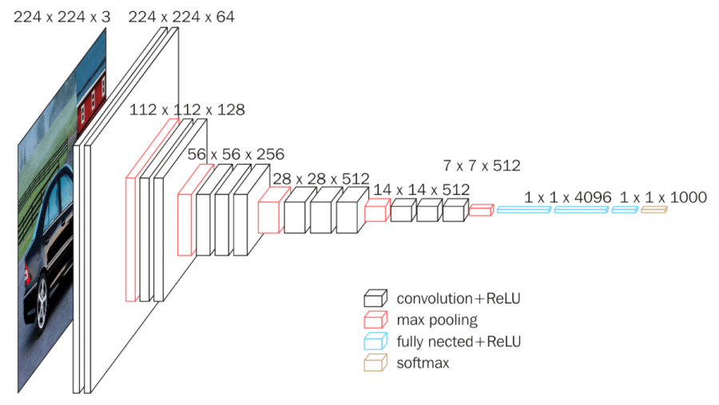

# 🎥 Human Action Recognition Using VGG16 and Transfer Learning

Welcome to the **Human Action Recognition** project! This repository leverages the VGG16 architecture and transfer learning to recognize human actions from images, enabling applications in video surveillance, human-computer interaction, and behavioral studies.

## 📚 Project Overview

Human Action Recognition (HAR) is a field focused on identifying specific actions of individuals based on image or video data. This project uses a pre-trained VGG16 model, fine-tuned to classify human actions through transfer learning.

### Why Action Recognition?
- **Enhanced Human-Computer Interaction**: HAR helps systems better understand and predict human behavior.
- **Intelligent Surveillance**: Recognizes potentially hazardous activities for automated alerts.
- **Healthcare Applications**: Can assist in tracking physical activity and monitoring patients.

## 🚀 Model Architecture

This project uses a **VGG16 CNN model** pre-trained on ImageNet. The model's top layers are removed, and new dense layers are added for action classification.

- **VGG16 Layers**: 16 layers trained on ImageNet
- **Input Shape**: 224x224 RGB images
- **Output Classes**: Various human actions, balanced and prepared for multiclass classification



## 🧠 Training Pipeline

1. **Data Preprocessing**: Images are resized to 224x224 pixels.
2. **Transfer Learning**: Freezing initial VGG16 layers; training custom layers on action dataset.
3. **Evaluation**: Model performance tracked using accuracy and loss metrics.

### 🏃 Sample Actions
- Walking
- Sitting
- Standing
- Running

## 📊 Results

- **Accuracy**: Achieved high accuracy on the test set
- **Loss**: Trained to minimize categorical cross-entropy loss

## 🔧 Installation

Clone the repository and install the dependencies.

```bash
git clone https://github.com/username/Human-Action-Recognition.git
cd Human-Action-Recognition
pip install -r requirements.txt

🏗️ How to Run the Project
Train the Model: Run the train.py file to train the model.
Test Prediction: Use predict.py to classify actions in new images or videos.
Streamlit Deployment: Use app.py to launch an interactive web app for training and testing.
To start the Streamlit app:

bash
Copy code
streamlit run app.py

├── data/                       # Dataset files
├── images/                     # Supporting images
├── model/                      # Trained model weights
├── app.py                      # Streamlit app for training/testing
├── train.py                    # Script for training the model
├── predict.py                  # Script for predictions
├── README.md                   # Project overview
└── requirements.txt            # Python dependencies

